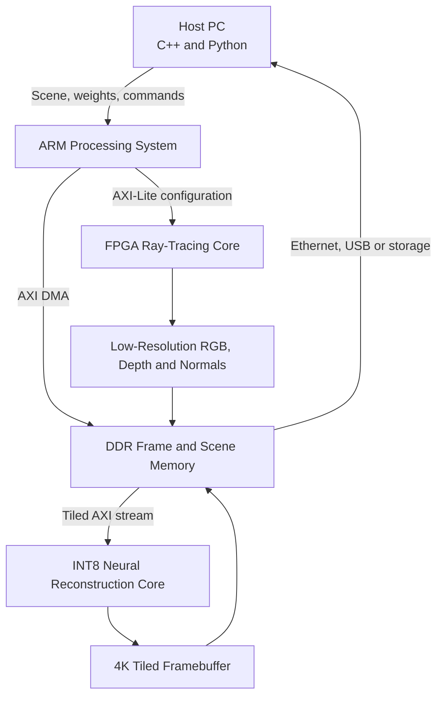

# FPGA-Based Sparse Ray Tracing and AI 4K Reconstruction Accelerator

## Complete Step-by-Step Project Blueprint

**Target platform:** ZedBoard / Zynq-7020 baseline  
**Languages:** Verilog or SystemVerilog, C++, Python  
**Tools:** Xilinx Vivado, Vitis or bare-metal SDK, PyTorch, ONNX, cocotb/pytest, GitHub Actions  
**Primary objective:** Render approximately 500,000 low-resolution pixels or samples, then reconstruct an 8.29-million-pixel 4K image using a quantized neural network accelerated on FPGA.

---

## 1. Executive Summary

The project is a hardware-software co-designed rendering system with two FPGA accelerators:

1. A sparse/low-resolution ray-tracing pipeline that renders a scene at approximately 960x540 resolution.
2. A quantized neural reconstruction pipeline that converts the low-resolution render and auxiliary geometry buffers into a 3840x2160 image.

The ARM processor on the Zynq device manages scene configuration, memory, DMA, accelerator control, and communication with the host. Python is used to train and quantize the reconstruction model. C++ is used for the software renderer, golden reference, driver, and system-control application. The FPGA performs the computationally expensive rendering and inference operations.

This is not intended to compete with NVIDIA DLSS. The goal is to demonstrate a complete, measurable FPGA proof of concept covering architecture, RTL, AI inference, memory systems, software integration, verification, and performance analysis.

---

## 2. Brutal Feasibility Boundary

### Realistic on a ZedBoard

- Ray tracing simple scenes containing spheres and a limited number of triangles.
- Low-resolution rendering at 320x180, 480x270, and eventually 960x540.
- Fixed-point ray generation and intersection.
- An INT8/INT4 lightweight reconstruction CNN.
- 2x upscaling in real time at smaller resolutions.
- 4x tiled reconstruction at low frame rates.
- Writing a complete 4K frame to DDR or transferring it to a host computer.
- Comparing standard and optimized multiplier architectures.

### Unrealistic as the first target

- Native real-time 4K ray tracing at 30 or 60 FPS.
- A large U-Net, transformer, diffusion model, or production DLSS equivalent.
- Complex scenes containing millions of triangles.
- Real-time global illumination with several rays per pixel.
- Holding an entire 4K RGB frame in BRAM.
- Displaying native 4K through the standard ZedBoard video output; the board should initially transfer or store the reconstructed 4K frame instead.

### Correct success criterion

The first major success is:

> Produce a correct 4K reconstructed image from a 960x540 FPGA-generated ray-traced input and report quality, latency, FPGA resources, bandwidth, and energy.

Real-time operation is an optimization goal, not the initial definition of success.

---

## 3. Project Objectives

### Core objectives

- Develop a reference ray tracer in C++.
- Design an FPGA ray-generation and intersection pipeline.
- Generate low-resolution RGB, depth, and normal buffers.
- Train a lightweight neural reconstruction model in Python/PyTorch.
- Quantize the model to INT8, with INT4 as an optional experiment.
- Implement the reconstruction network as a streaming FPGA accelerator.
- Integrate the accelerator with ARM software through AXI and DMA.
- Reconstruct a 4K frame using tiled processing.
- Replace standard multipliers with the proposed low-cost multiplier.
- Compare image quality, area, power, timing, bandwidth, and latency.

### Secondary objectives

- Add shadow rays and one-bounce reflections.
- Add a basic bounding-volume hierarchy (BVH).
- Add temporal information using the previous frame and motion vectors.
- Automate RTL simulation and software tests in CI.
- Create a reusable accelerator interface and register map.

### Non-goals for version 1

- Photorealistic production rendering.
- Dynamic scenes with complex skeletal animation.
- Training the model on the FPGA.
- Supporting arbitrary neural-network models.
- Building a full commercial graphics API.

---

## 4. Resolution and Data Definition

### Input frame

- Recommended final input: **960x540 = 518,400 pixels**.
- This is close to the proposed 500,000 rendered pixels.
- Initial development resolutions:
  - 160x90
  - 320x180
  - 480x270
  - 960x540

### Output frame

- Final output: **3840x2160 = 8,294,400 pixels**.
- Spatial scaling factor: 4x horizontally and 4x vertically.
- Pixel-count expansion: 16x.

### Input channels to the AI model

Do not provide only RGB. Use auxiliary rendering data:

| Channel | Purpose |
|---|---|
| Low-resolution RGB | Base rendered colour |
| Depth | Preserves object boundaries and geometry |
| Surface normals | Helps reconstruct shading and edges |
| Albedo/material colour | Separates texture from lighting |
| Confidence/sample count | Identifies noisy or undersampled pixels |
| Motion vectors, optional | Enables temporal reconstruction |
| Previous frame, optional | Reduces flicker and restores detail |

Version 1 should use RGB + depth + normals. Add temporal inputs only after the spatial pipeline works.

---

## 5. Top-Level System Architecture



### Responsibility split

| Component | Responsibility |
|---|---|
| Host Python | Dataset generation, training, quantization, evaluation |
| Host C++ | Golden renderer, scene loader, reference inference, benchmarking |
| ARM processor | Accelerator control, descriptor setup, DMA, interrupts, status reporting |
| FPGA ray core | Ray generation, geometry traversal, intersection, shading |
| FPGA AI core | Quantized convolution and 4x reconstruction |
| DDR | Scene data, input tiles, output tiles, weights, framebuffers |

---

## 6. Hardware Data Path

### Ray-tracing path

```text
Pixel Coordinate
    -> Camera-Ray Generator
    -> Optional AABB/BVH Test
    -> Sphere/Triangle Intersection
    -> Nearest-Hit Selection
    -> Normal and Depth Calculation
    -> Basic Material and Lighting
    -> RGB + Depth + Normal Output
    -> AXI Stream / DMA
```

### Reconstruction path

```text
DDR Input Tile
    -> Channel Normalization
    -> Convolution Layer 1
    -> Activation and Quantization
    -> Depthwise/Pointwise Feature Layers
    -> Final Convolution
    -> Pixel Shuffle or Learned Upsampling
    -> Output Clamping
    -> DDR 4K Tile
```

---

## 7. FPGA Ray-Tracing Modules

### 7.1 Camera-ray generator

Inputs:

- Pixel coordinates `(x, y)`
- Camera origin
- Camera forward, right, and up vectors
- Horizontal and vertical field of view

Outputs:

- Ray origin `(ox, oy, oz)`
- Ray direction `(dx, dy, dz)`
- Pixel identifier

Implementation notes:

- Begin with fixed-point Q-format arithmetic.
- Precompute camera constants in software.
- Avoid normalization hardware in version 1 where possible.
- Use a pipelined reciprocal or lookup/Newton-Raphson unit only when necessary.

### 7.2 Sphere intersection

Implement sphere intersection before triangles because it is easier to verify. Use it to validate the complete rendering pipeline.

Responsibilities:

- Calculate the quadratic intersection terms.
- Reject negative discriminants.
- Choose the nearest positive intersection.
- Return depth and hit position.

### 7.3 Triangle intersection

Implement a pipelined Moller-Trumbore intersection unit.

Responsibilities:

- Calculate edge vectors.
- Compute determinant and barycentric coordinates.
- Reject parallel rays and out-of-triangle hits.
- Return the nearest positive intersection distance.

### 7.4 Nearest-hit reducer

- Compare hits across scene objects.
- Preserve object ID, depth, normal, and material ID.
- Start with sequential object traversal.
- Add multiple parallel intersection lanes after correctness is proven.

### 7.5 BVH/AABB traversal, advanced stage

- Store BVH nodes in DDR.
- Cache frequently used nodes in BRAM.
- Implement ray-AABB intersection.
- Use a small traversal stack in BRAM.
- Treat BVH as an advanced milestone, not a starting requirement.

### 7.6 Shader

Version 1:

- Constant material colour
- Ambient light
- Lambertian diffuse light
- Background colour

Version 2:

- Hard shadows
- One reflective bounce
- Material lookup
- Simple texture sampling

### 7.7 G-buffer output packer

Pack the following into an AXI stream:

- RGB
- Depth
- Normal X/Y/Z
- Pixel ID
- Valid/end-of-line/end-of-frame flags

Keep depth and normals at reduced precision to control bandwidth.

---

## 8. Numerical Representation

### Recommended approach

1. Use floating point in the C++ and Python reference implementations.
2. Profile the numerical ranges of every signal.
3. Select fixed-point formats separately for origins, directions, depth, normals, and colour.
4. Build bit-accurate Python models of the fixed-point operations.
5. Compare RTL against both floating-point and bit-accurate references.

Possible starting formats:

| Quantity | Starting representation |
|---|---|
| RGB | Unsigned 8-bit or 10-bit |
| Normal components | Signed 12-16-bit fixed point |
| Depth | Unsigned 16-24-bit fixed point |
| Ray origin/direction | Signed 24-32-bit fixed point |
| CNN activations | INT8 |
| CNN accumulators | INT24 or INT32 |
| CNN weights | INT8, later INT4 |

These formats are starting points and must be selected through range analysis rather than assumption.

---

## 9. AI Reconstruction Model

### Recommended version-1 model

Use a small ESPCN/FSRCNN-inspired network:

```text
Input: RGB + Depth + Normals
3x3 Conv, 16 or 24 channels, ReLU
3x3 Depthwise Conv, ReLU
1x1 Pointwise Conv, ReLU
3x3 Conv producing 3 x 16 channels
Pixel Shuffle x4
Output: 4K RGB tile
```

Why this model:

- Small enough for FPGA implementation.
- Convolutions map cleanly to multiply-accumulate hardware.
- Pixel shuffle avoids expensive deconvolution.
- Depthwise-separable layers reduce multiplications.
- Easy to quantize and benchmark.

### Training losses

Start with:

```text
Total Loss = L1 + 0.2 * (1 - SSIM) + 0.05 * Edge Loss
```

Optional later additions:

- Perceptual loss
- Temporal consistency loss
- Depth-aware edge loss
- Normal-guided boundary loss

Do not begin with adversarial loss; it may produce visually sharp but incorrect details.

### Training dataset

Generate paired data:

- Ground truth: high-sample or high-resolution render.
- Input: low-resolution/low-sample render.
- Auxiliary data: low-resolution depth and normals.

Dataset sources:

- Procedurally generated scenes from the C++ renderer.
- Blender-generated synthetic scenes.
- Public scene assets with clear licensing.

Split scenes, not individual frames, between training and testing. Otherwise, the reported metrics may be inflated by scene leakage.

### Quantization flow

1. Train an FP32 model.
2. Establish FP32 PSNR, SSIM, and LPIPS baselines.
3. Apply INT8 quantization-aware training.
4. Validate INT8 accuracy.
5. Export integer weights, scales, and zero points.
6. Create a bit-accurate Python integer-inference model.
7. Implement the same arithmetic in RTL.
8. Attempt INT4 only after the INT8 implementation is stable.

---

## 10. AI Accelerator Microarchitecture

### 10.1 Streaming convolution engine

- Use line buffers in BRAM.
- Generate sliding 3x3 windows.
- Process pixels in raster order.
- Reuse weights across the image.
- Parameterize parallel input channels and output channels.

### 10.2 MAC array

- Begin with DSP48-based multiplication.
- Accumulate at higher precision.
- Apply bias, requantization, saturation, and activation.
- Add the custom multiplier only after the baseline passes all tests.

### 10.3 Weight memory

- Store small-layer weights in BRAM.
- Load weights from DDR during initialization if necessary.
- Use double-buffering if layer weights cannot remain on chip.

### 10.4 Pixel shuffle

- The network generates 48 output channels for RGB 4x upscaling.
- Rearrange channels into a 4x4 spatial block.
- Implement the rearrangement as address/control logic rather than arithmetic.

### 10.5 Tiling

Process the image in tiles, for example 64x64 or 128x64 input pixels.

Requirements:

- Include halo pixels around every tile for 3x3 convolution.
- Remove overlapped borders before writing output.
- Prevent visible seams between tiles.
- Measure DMA overhead for different tile sizes.

---

## 11. ARM and C++ Software

### ARM application responsibilities

- Initialize clocks, DDR, interrupts, and DMA.
- Load scene data and network weights.
- Configure camera and accelerator registers.
- Launch the ray-tracing accelerator.
- Wait for or interrupt on frame completion.
- Launch tiled AI reconstruction.
- Collect performance counters.
- Transfer or store the reconstructed frame.

### C++ design

Use object-oriented modules such as:

```text
Scene
Camera
Material
Triangle
Sphere
BVHNode
SoftwareRayTracer
FpgaRayTracerDriver
ReconstructionDriver
FrameBuffer
BenchmarkRunner
```

### Multithreading requirement

Use a C++ thread pool on the host for:

- Dataset generation
- Tile preparation
- DMA scheduling or host transfers
- Result validation
- Metric calculation

Measure the difference between single-threaded and multithreaded execution. This directly supports the Nokia JD's operating-systems and multithreading requirements.

---

## 12. AXI Interface and Register Map

### Interfaces

- **AXI4-Lite:** Control and status registers.
- **AXI4 Memory-Mapped:** Scene, weight, and framebuffer access.
- **AXI4-Stream:** Internal pixel streams and DMA.
- **Interrupt:** Frame/tile completion and error notification.

### Example control registers

| Offset | Register | Purpose |
|---:|---|---|
| 0x00 | CONTROL | Start, reset, interrupt enable |
| 0x04 | STATUS | Busy, done, error |
| 0x08 | WIDTH | Input width |
| 0x0C | HEIGHT | Input height |
| 0x10 | SCENE_BASE | Scene data address |
| 0x14 | INPUT_BASE | Input/G-buffer address |
| 0x18 | OUTPUT_BASE | Output framebuffer address |
| 0x1C | WEIGHT_BASE | Neural weights address |
| 0x20 | TILE_CONFIG | Tile dimensions and halo |
| 0x24 | CYCLE_COUNT | Total accelerator cycles |
| 0x28 | STALL_COUNT | Memory/backpressure stalls |
| 0x2C | ERROR_CODE | Diagnostic status |

Keep one shared register-map document and generate matching C/C++ constants.

---

## 13. Step-by-Step Implementation Plan

### Phase 0: Define the measurable specification

Tasks:

- Freeze version-1 scene features.
- Select the initial and final resolutions.
- Define maximum object count.
- Define image-quality metrics.
- Define FPGA resource and frequency targets.
- Define interfaces and output format.

Exit criteria:

- A one-page specification with no unresolved core requirements.

### Phase 1: Build the C++ golden ray tracer

Tasks:

- Implement camera rays.
- Implement spheres.
- Implement triangles.
- Add nearest-hit selection.
- Add Lambertian lighting.
- Export RGB, depth, and normals.
- Add deterministic test scenes.

Exit criteria:

- Reproducible reference images and unit tests for intersections.

### Phase 2: Build the AI dataset pipeline

Tasks:

- Generate paired low/high-resolution frames.
- Export auxiliary channels.
- Add randomized cameras, lights, materials, and geometry.
- Split data by scene.
- Record all generation parameters.

Exit criteria:

- A versioned dataset manifest and reproducible generation command.

### Phase 3: Train the FP32 reconstruction model

Tasks:

- Establish bicubic and nearest-neighbour baselines.
- Train the small spatial reconstruction network.
- Measure PSNR, SSIM, LPIPS, parameter count, and MAC count.
- Inspect failure cases such as thin edges and reflections.

Exit criteria:

- Model outperforms bicubic on held-out scenes without obvious artifacts.

### Phase 4: Quantize and create the integer reference

Tasks:

- Apply INT8 quantization-aware training.
- Export weights and scales.
- Implement bit-accurate Python integer inference.
- Measure accuracy loss from FP32 to INT8.

Exit criteria:

- Integer reference output is deterministic and sufficiently close to FP32.

### Phase 5: Implement FPGA ray tracing at a tiny resolution

Tasks:

- Implement camera-ray generation.
- Implement sphere intersection.
- Add one simple shader.
- Stream output into a small test framebuffer.
- Compare every pixel with the fixed-point reference.

Exit criteria:

- Exact agreement with the bit-accurate reference for deterministic scenes.

### Phase 6: Add triangle intersection and scene traversal

Tasks:

- Implement Moller-Trumbore intersection.
- Add object iteration and nearest-hit logic.
- Add normal/depth output.
- Profile cycles per ray.

Exit criteria:

- Correctly renders a mixed sphere/triangle scene.

### Phase 7: Integrate AXI DMA and ARM control

Tasks:

- Package the ray tracer as an AXI-controlled IP block.
- Create DMA descriptors and frame buffers.
- Add interrupts and timeout/error handling.
- Build the C++ driver.

Exit criteria:

- ARM software can launch a render and retrieve a complete frame reliably.

### Phase 8: Implement one convolution layer in FPGA

Tasks:

- Build line buffers and window generator.
- Implement INT8 MACs and accumulation.
- Implement requantization and activation.
- Compare RTL against the integer Python reference.

Exit criteria:

- One layer passes randomized and boundary-case tests.

### Phase 9: Implement the full reconstruction network

Tasks:

- Connect all network layers.
- Add weight loading.
- Add pixel shuffle.
- Add tiled DDR processing.
- Validate tile boundaries and halos.

Exit criteria:

- FPGA network output matches the integer reference within the defined tolerance.

### Phase 10: End-to-end integration

Tasks:

- Render a low-resolution frame on FPGA.
- Store RGB/depth/normals in DDR.
- Reconstruct the frame using the FPGA AI core.
- Assemble the complete output image.
- Transfer the image to the host.

Exit criteria:

- One command produces the final reconstructed image and benchmark report.

### Phase 11: Integrate the low-cost multiplier

Tasks:

- Replace selected standard MAC multipliers.
- Re-run synthesis and timing.
- Re-run all functional and image-quality tests.
- Compare standard, DSP, zero-aware, and optional approximate versions.

Exit criteria:

- The proposed multiplier provides a measurable system-level benefit without unacceptable image-quality loss.

### Phase 12: Optimization and advanced features

Possible tasks:

- Add parallel intersection lanes.
- Add BVH traversal.
- Add temporal previous-frame input.
- Add motion vectors.
- Add INT4 experiments.
- Add clock gating or zero skipping.
- Improve DMA overlap using double buffering.

Only begin this phase after the complete baseline is reproducible.

---

## 14. Verification Strategy

### Unit-level RTL verification

Test independently:

- Fixed-point add, multiply, reciprocal, and square-root approximations
- Ray generator
- Sphere intersection
- Triangle intersection
- Nearest-hit reducer
- Shader
- AXI-stream packer
- Line buffer/window generator
- MAC unit
- Quantizer
- Pixel shuffle

### Reference models

Maintain three levels:

1. Floating-point C++/Python reference.
2. Bit-accurate fixed-point/integer Python reference.
3. RTL implementation.

The RTL should be compared primarily with the bit-accurate reference.

### System tests

- Empty scene
- One sphere
- One triangle
- Intersecting/overlapping objects
- Rays parallel to triangles
- Near-zero intersection values
- Maximum/minimum fixed-point values
- Tile boundaries
- Odd image widths
- DMA backpressure
- Reset during operation
- Invalid register configuration
- Timeout and recovery

### Automation

- Run Python unit tests with pytest.
- Run C++ tests with GoogleTest or Catch2.
- Run RTL tests with cocotb and an open simulator where possible.
- Run linting and build checks in GitHub Actions.
- Keep proprietary Vivado synthesis as a manually triggered/local stage if licensing prevents CI execution.

---

## 15. Benchmark and Evaluation Plan

### Image quality

| Metric | Purpose |
|---|---|
| PSNR | Pixel-level reconstruction error |
| SSIM | Structural similarity |
| LPIPS | Perceptual similarity |
| Edge error | Thin lines and object boundaries |
| Temporal error | Flicker between frames, advanced stage |

### Hardware

- LUTs
- Flip-flops
- BRAM
- DSP slices
- Maximum clock frequency
- Worst setup slack
- Dynamic and static power estimates
- Energy per frame

### Performance

- Rays per second
- Intersections per second
- CNN pixels per second
- Cycles per rendered pixel
- Cycles per reconstructed output pixel
- DMA bandwidth
- Memory-stall cycles
- End-to-end latency
- Frames per second at each resolution

### Required comparisons

1. Nearest-neighbour upscale.
2. Bicubic upscale.
3. FP32 software model.
4. INT8 software model.
5. FPGA INT8 baseline.
6. FPGA with custom low-cost multiplier.
7. Optional FPGA INT4/approximate variant.

Never report only hardware savings. A reduced multiplier is valuable only if the resulting image quality remains acceptable.

---

## 16. Multiplier Research Contribution

### Research question

> Can a sparsity-aware or precision-configurable multiplier reduce the area, power, or latency of an FPGA neural reconstruction accelerator while preserving ray-traced image quality?

### Candidate multiplier modes

- Exact INT8
- Exact INT4
- Zero-detection bypass
- Leading-zero-based reduced computation
- Configurable 4x4/8x8 operation
- Error-bounded approximate multiplication
- Posit-based multiplication, only if it provides a justified advantage

### Correct evaluation

Compare the multiplier at three levels:

1. **Unit level:** area, delay, power, functional error.
2. **CNN level:** layer output error and reconstruction metrics.
3. **System level:** FPS, energy/frame, bandwidth, and final visual quality.

This three-level evaluation differentiates the work from an isolated arithmetic block.

---

## 17. Recommended Repository Structure

```text
fpga-ai-ray-reconstruction/
├── README.md
├── LICENSE
├── docs/
│   ├── architecture.md
│   ├── requirements.md
│   ├── register-map.md
│   ├── verification-plan.md
│   └── results.md
├── software/
│   ├── cpp-renderer/
│   ├── arm-driver/
│   ├── benchmark/
│   └── tests/
├── ai/
│   ├── dataset/
│   ├── models/
│   ├── train.py
│   ├── quantize.py
│   ├── integer_reference.py
│   └── evaluation/
├── rtl/
│   ├── common/
│   ├── ray_generator/
│   ├── intersection/
│   ├── shader/
│   ├── reconstruction/
│   ├── axi/
│   └── top/
├── verification/
│   ├── cocotb/
│   ├── vectors/
│   ├── reference/
│   └── coverage/
├── fpga/
│   ├── vivado/
│   ├── constraints/
│   └── scripts/
├── results/
│   ├── images/
│   ├── synthesis/
│   ├── timing/
│   ├── power/
│   └── benchmarks/
└── .github/workflows/
```

Do not commit generated Vivado build directories. Commit scripts, constraints, reports, small test vectors, and reproducible instructions.

---

## 18. Suggested 16-Week Schedule

| Week | Deliverable |
|---:|---|
| 1 | Requirements, architecture, repository, baseline tests |
| 2 | C++ camera and sphere renderer |
| 3 | Triangle intersection, depth, normals, deterministic scenes |
| 4 | Dataset generator and bicubic baseline |
| 5 | Small FP32 reconstruction model |
| 6 | INT8 QAT and integer Python reference |
| 7 | RTL ray generator and sphere intersection |
| 8 | RTL triangle intersection and nearest-hit logic |
| 9 | AXI packaging, DMA, ARM driver |
| 10 | Streaming INT8 convolution engine |
| 11 | Full small reconstruction network |
| 12 | Tiling, halo handling, DDR integration |
| 13 | Complete FPGA-to-FPGA pipeline |
| 14 | Custom multiplier integration |
| 15 | Benchmarking, timing, power, image-quality analysis |
| 16 | Documentation, demo video, final report, résumé bullets |

If working alone part-time, 20-24 weeks is more realistic. A correct 1080p demonstration is better than an unfinished 4K claim.

---

## 19. Risks and Mitigations

| Risk | Impact | Mitigation |
|---|---|---|
| CNN does not fit | Cannot deploy full model | Reduce channels, use depthwise layers, tile, reuse MACs |
| DDR bandwidth bottleneck | Low FPS | Tile, compress channels, double-buffer, profile stall counters |
| Fixed-point precision failure | Incorrect geometry | Range profiling, bit-accurate model, wider intersection arithmetic |
| 4K output too slow | Missed performance target | Demonstrate correctness first; publish 1080p real-time and 4K low-FPS results |
| Tile seams | Poor image quality | Add halo regions and discard invalid tile borders |
| Approximate multiplier damages quality | Weak research result | Support exact mode and report quality/efficiency trade-off honestly |
| Scope explosion | Project remains unfinished | Freeze version 1 and postpone BVH/temporal rendering |
| Unsupported metric claims | Recruiter distrust | Commit reports, scripts, logs, and test images |

---

## 20. Project Deliverables

### Minimum viable project

- C++ golden renderer.
- Python dataset pipeline.
- Quantized AI reconstruction model.
- FPGA ray generator and intersection unit.
- FPGA single/multi-layer convolution accelerator.
- ARM control application.
- One end-to-end reconstructed image.
- Automated unit tests.
- Synthesis and timing reports.
- Benchmark comparison.

### Strong final project

- 960x540 low-resolution FPGA render.
- 4x tiled FPGA neural reconstruction.
- Full 3840x2160 image output to DDR/host.
- Exact versus optimized multiplier comparison.
- Image-quality, resource, timing, power, and latency results.
- Reproducible repository.
- Architecture diagram and demo video.
- Technical report explaining failures as well as successes.

---

## 21. ATS Alignment with the Nokia Associate Engineer JD

| JD requirement | Project evidence |
|---|---|
| C++/Python | Golden renderer, training, quantization, drivers, benchmarks |
| Object-oriented programming | C++ scene, geometry, driver, and benchmark classes |
| Operating systems/multithreading | Host thread pool, asynchronous transfers, synchronization |
| Software/hardware/FPGA integration | ARM + AXI + DMA + FPGA ray/AI accelerators |
| System design and reviews | Requirements, architecture, interfaces, register map |
| Testing and debugging | Golden models, cocotb, assertions, unit/system tests |
| PoC using AI technologies | Quantized neural reconstruction accelerator |
| CI and automation | GitHub Actions, scripted simulation, regression reports |
| Customer-quality delivery mindset | Reproducible build, error handling, documentation, benchmark evidence |

This project matches the JD far better than another isolated multiplier because it proves system-level integration.

---

## 22. Future Résumé Bullets

Use these only after producing real measurements. Replace every placeholder with verified numbers.

- Designed an FPGA-based sparse ray-tracing and neural reconstruction system that generated **960x540 RGB/depth/normal buffers** and reconstructed **3840x2160** frames through a tiled INT8 CNN accelerator controlled by C++ software over AXI DMA.
- Implemented pipelined fixed-point ray generation and triangle-intersection units plus a streaming depthwise-convolution engine, achieving **X MHz**, **Y rays/s**, and **Z ms** end-to-end latency on Zynq-7020.
- Built bit-accurate Python golden models, cocotb regressions, C++ system tests, and automated CI; validated FPGA output against software references across **N scenes/test vectors**.
- Integrated a sparsity-aware multiplier into the CNN MAC array, reducing **LUT/DSP use by X%** and **energy/frame by Y%** while limiting reconstruction degradation to **Z dB PSNR**.

Do not use the words "real time," "4K accelerator," or percentage improvements until the corresponding result is reproducible.

---

## 23. Definition of Done

The project is complete when all of the following are true:

- One command launches the complete pipeline.
- The FPGA generates the low-resolution rendering buffers.
- The FPGA reconstruction engine processes all tiles.
- The host receives or stores a complete 4K output image.
- RTL matches the integer reference within the documented tolerance.
- The repository contains synthesis, timing, power, and quality results.
- The optimized multiplier is compared against a standard baseline.
- The README provides reproducible build and test instructions.
- No performance or accuracy claim lacks supporting evidence.

---

## 24. Immediate Next Actions

Complete these in order:

1. Create the repository using the proposed structure.
2. Write the one-page version-1 requirements document.
3. Implement a C++ renderer with one sphere and one light.
4. Export RGB, depth, and normals at 320x180 and 1280x720.
5. Train a tiny 4x spatial reconstruction model.
6. Quantize the model to INT8 and create the integer reference.
7. Implement only the FPGA camera-ray generator and sphere-intersection unit.
8. Verify every output against a bit-accurate Python model.
9. Package the first working unit behind AXI-Lite/AXI-Stream.
10. Expand to triangle rendering only after the sphere pipeline is stable.

The most important discipline is to maintain a working end-to-end baseline at every stage. Add complexity only after the previous stage is correct, benchmarked, and documented.
